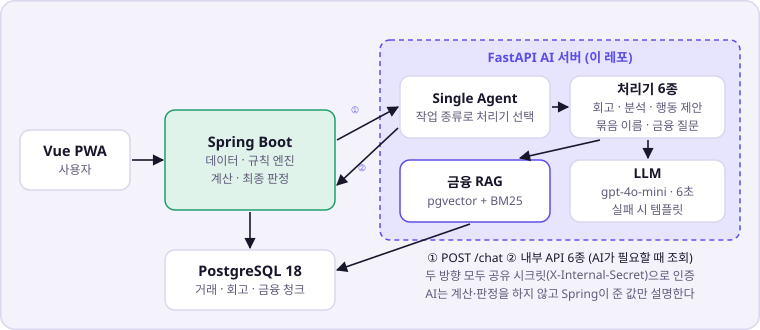
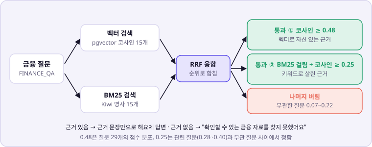

# 소때잡 AI Server

소때잡(소비의 '때'를 잡다)의 AI 서버다. 필요한 거래를 며칠 뒤 대화로 회고하고, Spring이 계산한 소비 분석을 사람 말로 풀어 주고, 금융 질문에 근거 문서로 답한다. 2026 KB IT's Your Life 해커톤 본선 프로젝트다.

계산과 판정은 Spring이 하고, 이 서버는 **근거 안에서만 말한다.** 금융 질문은 근거 문서가 없으면 LLM을 부르지 않고 모른다고 답하고, 분석 문장에 집계에 없는 숫자가 나오면 그 문장을 버린다. 검색은 유사도 하한으로 근거 없는 질문 11/14를 막았고, 그 하한에 같이 막힌 정답형 질문은 벡터와 BM25를 합친 하이브리드와 이중 게이트로 다시 찾게 했다(실패하던 8개 모두).

코딩 에이전트(Claude Code · Codex)와 함께 작업한다면 [AGENTS.md](AGENTS.md)를 먼저 읽는다. 브랜치·커밋·PR 규칙은 [CONTRIBUTING.md](CONTRIBUTING.md)에 있다. 계약의 정본은 문서 저장소 [`sottaejap-docs`](https://github.com/jittaejap/sottaejap-docs)의 `01_결정로그.md`·`05_API_명세서.md` §3·`07_기술스택_레포구성.md`다.

---

## 필요한 문서 찾기

| 하려는 일 | 문서 |
| --- | --- |
| 처음 참여한다 | [온보딩](docs/ONBOARDING.md) |
| Tool 추가, Spring 연동, RAG, 테스트 규칙 확인 | [개발 문서](docs/DEVELOPMENT.md) 1~9절 |
| 금융 질문 품질을 어떻게 쟀는지 확인 | [개발 문서](docs/DEVELOPMENT.md) 10·16·18절 |
| 회고 추출 품질을 어떻게 쟀는지 확인 | [개발 문서](docs/DEVELOPMENT.md) 11절 |
| 프롬프트 말투·폴백 사고 기록 | [개발 문서](docs/DEVELOPMENT.md) 12~15·17절 |
| `/chat`을 작업 종류별로 직접 호출 | [Postman 컬렉션](docs/postman/sottaejap-ai.postman_collection.json) |
| 모듈별 책임 | `app/agent`, `app/rag`, `app/reflection`, `app/tools`의 README |

---

## 아키텍처



| Spring (`sottaejap-server`) | Python AI Server (이 레포) |
|---|---|
| 거래·회고·목표 데이터 관리 | 처리기 라우팅과 자연어 설명 |
| 개인 Baseline 및 Anomaly Score 계산 | 회고 후보 값 구조화 |
| 후보 선정, 반복 행동 최종 분류, `reason_code` 산출 | 금융 RAG 검색과 근거 기반 답변 |
| 만족도 보정, 절감액·감소액·달성률 계산 | 숫자 가드, 말투 규칙 |
| Rule Engine과 최종 데이터·판정(`verdict`) | Spring API 통신, LLM 폴백 |

```text
Spring = 데이터 / 규칙 / 계산 / 최종 판정
Python = 자연어 / 설명 / 검색
```

- Spring이 AI를 부르는 경로는 `POST /chat` 하나다. AI가 데이터가 필요하면 Spring 내부 AI API 6종을 다시 부른다(pull). 두 방향 모두 같은 공유 시크릿(`X-Internal-Secret`)으로 인증한다.
- 전체 채팅 기록을 장기 기억으로 쓰지 않는다. Task 상태는 Spring/DB가 관리하고, AI는 요청에 담긴 현재 Task, 구조화된 상태, 최근 대화만 쓴다.

---

## 쉽게 말하면

### 요청 하나가 지나가는 길

```text
POST /chat  ← X-Internal-Secret 검사 (없거나 다르면 401)
  ↓
SingleAgent.run  — task_context.task로 처리기 선택 (app/agent/handlers/__init__.py)
  ↓
처리기 — 필요하면 Tool 호출 (Spring 내부 API · 금융 RAG) → LLM 1회 → 검사
  ↓
답변 2,000자 상한 → ChatResponse
```

| 작업(`task`) | 처리기가 하는 일 |
| --- | --- |
| `REFLECTION` | 6단계 회고 대화(인사 → 만족도 → 목적 → 동행인 → 반복 의향 → 확인). 후보 값과 공감 한마디를 LLM 1회로 받는다 |
| `ANALYSIS` | Spring이 계산한 소비 집계 안에서 자유 질문에 답한다. 집계와 무관한 질문은 고정 안내 |
| `ANALYSIS_NARRATE` | '나만의 특징' 한 문장 |
| `ACTION_PLAN` | Spring이 계산한 행동 제안의 이유를 대화체로 설명 |
| `CLUSTER_NAMING` | Spring이 만든 소비 묶음에 12자 이내 이름 |
| `FINANCE_QA` | 금융 질문에 근거 문서로 답한다. 근거가 없으면 LLM 없이 고정 문장 |

처리기는 작업 종류로 코드가 고르고, 처리기가 Tool을 직접 호출한다. LLM이 Tool을 고르는 function calling은 쓰지 않는다.

**LLM이 실패하면**: 1회 6초, 일시적 오류(타임아웃·연결·429·5xx)만 1회 재시도한다(`app/core/llm.py`). 그래도 실패하거나 키가 없으면 템플릿 답변에 `fallback: true`를 붙여 **200**으로 돌려준다(`app/ai/fallback.py`). Tool 호출이 실패하면 `HandlerContext.call_tool`이 `success: false` 결과로 바꿔 처리기가 근거없음 경로로 간다.

### 금융 질문의 검색 게이트



1. 질문을 임베딩해 pgvector 코사인으로 15개, Kiwi로 뽑은 명사로 BM25 15개를 찾는다.
2. 두 순위를 RRF(k=60)로 합친다. 점수 단위가 달라 점수 대신 순위로 합친다.
3. 코사인 0.48 이상이거나, BM25에 걸리면서 코사인 0.25 이상인 후보만 근거로 남긴다(`app/rag/retriever.py`).
4. 근거가 있으면 해요체 규칙을 근거 앞뒤에 둔 지시문으로 LLM이 답한다. 없으면 "확인할 수 있는 금융 자료를 찾지 못했어요."

- 0.48은 정답형 15개·근거없음형 14개 질문의 1위 유사도 분포로 정했다(#28).
- BM25는 "적금이란"처럼 짧은 질문이 하한에 근소하게 막히는 문제를 풀려고 더했다(#78).
- BM25 점수만으로는 작은 코퍼스에서 무관한 질문을 못 걸러서, BM25로 살린 후보에도 코사인 0.25 하한을 둔다.
- BM25는 기동 때 `financial_chunks`를 한 번 읽어 메모리에 짓는다. 실패하면 벡터 전용으로 계속 뜬다.

### 숫자 가드

`ANALYSIS` · `ANALYSIS_NARRATE` · `ACTION_PLAN`은 LLM이 쓴 문장의 숫자를 모두 뽑아 Spring이 준 집계 숫자와 대조한다(`app/agent/handlers/number_guard.py`). 하나라도 근거에 없으면 그 문장을 버리고 템플릿으로 바꾼다.

- `5천만`·`1억`처럼 천·만·억이 붙은 숫자는 실제 배수로 바꿔 대조한다(#66).
- 한 자리 정수는 서수일 수 있어 건너뛰되, 뒤에 `%`가 오면 반드시 검사한다.
- 퍼센트는 `share`에서 만든 별도 목록과 대조해 "3월"의 3과 "3%"를 섞지 않는다.

---

## 측정에서 무엇을 보았나

단위 테스트는 LLM을 가짜로 바꿔 돌리므로, 실제 모델의 동작은 작업마다 반복 호출해 따로 쟀다. 자세한 기록은 [개발 문서](docs/DEVELOPMENT.md)에 있다.

| 항목 | 결과 | 근거 |
| --- | --- | --- |
| 유사도 하한 0.48 | 근거없음형 11/14 차단, 정답형 10/15 유지(5개 같이 막힘) | #73 |
| 하이브리드 + 이중 게이트 | 실패하던 정답형 8개 모두 정답 문단(인플레이션은 문서 보강 병행), 무관 질문 4개 계속 차단 | #79, 18절 |
| 회고 추출 | 29문장 × 10회, 재현율 250/250 유지, 과잉추론 22건 → 0건 | 11절 |
| 행동 제안 근거 밖 숫자 | 2/2 발생 → 숫자 가드로 6/6 폴백 | #63 |
| 묶음 이름 빈 입력 | 5/5 문장 잘림 → LLM 호출 생략, 3/3 정상 | #63, 13절 |
| 분석 한 줄 요약 반말 | 5/8 → 0/10 | #63 |
| 소비 분석 반말 질문 | 11/11 반말 → 13/14 정상 | 14절 |

---

## 알려진 한계

- 시점이 있는 질문(예: 금리 전망)은 코퍼스 속 예시 수치를 실제 답처럼 전할 수 있다(10절 알려진 한계).
- 측정은 질문 8~29개 규모의 재현 확인이라 통계적 지표가 아니다.
- 말투 규칙은 13/14로 100%가 아니다.
- BM25 인덱스는 인메모리·단일 인스턴스 전제다. 기동 때 구축이 실패하면 재기동 전까지 벡터 전용으로 동작한다(18절).

---

## Directory 구조

```text
.
├── AGENTS.md                 # 에이전트가 먼저 읽는 전제 (CLAUDE.md는 포인터)
├── CONTRIBUTING.md           # 브랜치 · 커밋 · PR · 검사
├── README.md
├── docs/
│   ├── ONBOARDING.md
│   ├── DEVELOPMENT.md        # 개발 규칙과 실측 기록
│   ├── img/                  # README 그림
│   └── postman/              # TaskType 6종 호출 컬렉션
├── app/
│   ├── main.py               # FastAPI 앱 · GET /health · 기동 때 RAG·BM25 준비
│   ├── api/chat.py           # POST /chat · X-Internal-Secret 검사
│   ├── agent/                # SingleAgent · handlers(작업 6종 · number_guard) · prompt · state
│   ├── ai/fallback.py        # LLM 장애·근거없음 템플릿
│   ├── tools/                # Spring · RAG를 감싸는 얇은 Tool 6종
│   ├── reflection/           # 회고 후보 추출 · 표준 태그 enum · normalize/validate
│   ├── rag/                  # 임베딩 · pgvector 검색 · BM25(keyword_index) · 게이트
│   ├── clients/spring_client.py  # Spring 내부 AI API 6종 — 유일한 HTTP 지점
│   ├── schemas/              # chat · tool · common(TaskType · ReflectionStep)
│   └── core/                 # config(Settings) · llm(타임아웃 · 재시도)
├── scripts/                  # 로컬 전용 도구 (OPENAI_API_KEY · DATABASE_URL 필요)
│   ├── ingest_financial_docs.py
│   └── eval_reflection_extraction.py  # 회고 추출 품질 실측 (DEVELOPMENT §11)
├── local/                    # FINANCE_QA 로컬 검증 화면 · LLM-as-a-Judge (DEVELOPMENT §10)
├── tests/                    # 외부 서비스 무호출
├── .github/                  # CI(pytest · docker build) · 배포 · Issue · PR 템플릿
├── Dockerfile
├── requirements.txt          # 범위
├── requirements.lock         # 고정 (Python 3.12 컨테이너에서 생성)
└── .env.example
```

## 기술 스택

- Python 3.12 (팀 통일 — E-26)
- FastAPI, Uvicorn, Pydantic, pydantic-settings, httpx
- OpenAI Python SDK — `gpt-4o-mini` (E-25)
- PostgreSQL 18 + pgvector(asyncpg), Kiwi(`kiwipiepy`) + `rank-bm25`
- pytest

LangGraph, CrewAI 같은 Agent Framework나 복잡한 RAG Framework는 쓰지 않는다. uv·pyproject를 쓰지 않고 `pip` + `venv`로 통일한다.

## 환경 변수

`.env.example`을 `.env`로 복사한 뒤 로컬 값을 설정한다. 실제 `.env`는 Git에 포함하지 않는다.

| 변수 | 필수 | 설명 | 기본값 |
|---|---:|---|---|
| `OPENAI_API_KEY` | 아니요 | OpenAI API 인증 키. 없으면 모든 `/chat`이 템플릿 응답(`fallback: true`) | 없음 |
| `OPENAI_MODEL` | 아니요 | 공통 LLM 모델 | `gpt-4o-mini` |
| `LLM_TIMEOUT_SECONDS` | 아니요 | LLM 1회 호출 타임아웃(초). 초과 시 1회 재시도 후 템플릿 (NFR-04) | `6` |
| `SPRING_BASE_URL` | Spring 연동 시 | Spring 서비스 Base URL | `http://localhost:8080` |
| `SPRING_TIMEOUT_SECONDS` | 아니요 | AI → Spring 내부 API Timeout(초) | `3` |
| `INTERNAL_SHARED_SECRET` | **예** | `X-Internal-Secret` 공유 시크릿. `sottaejap-server`의 `AI_SHARED_SECRET`과 같은 값. **비어 있으면 `/chat`이 전부 401** | 없음 |
| `DATABASE_URL` | 금융 RAG 사용 시 | PostgreSQL/pgvector 연결 문자열(asyncpg 형식). 비어 있으면 금융 질문은 근거없음 답변 | 없음 |
| `AI_SERVER_HOST` | 아니요 | Uvicorn 바인딩 Host | `0.0.0.0` |
| `AI_SERVER_PORT` | 아니요 | Uvicorn 포트 | `8000` |
| `PYTHONUTF8` | 아니요 | Windows 인코딩 강제 (07 §5-3) | `1` |

## 로컬 실행

```bash
python3.12 -m venv .venv          # Windows: py -3.12 -m venv .venv
source .venv/bin/activate         # Windows: .\.venv\Scripts\Activate.ps1
python -m pip install -r requirements.lock
cp .env.example .env              # Windows: Copy-Item .env.example .env
# .env의 INTERNAL_SHARED_SECRET을 팀 공유값으로 채운다
uvicorn app.main:app --reload --host 0.0.0.0 --port 8000
```

실행 후 다음 주소를 확인한다.

- Health: `http://localhost:8000/health`
- Swagger UI: `http://localhost:8000/docs`

기본 Chat 요청 (헤더가 없으면 401):

```bash
curl -X POST http://localhost:8000/chat \
  -H 'Content-Type: application/json' \
  -H 'X-Internal-Secret: <INTERNAL_SHARED_SECRET>' \
  -d '{"message":"이번 소비를 돌아보고 싶어요","user_id":"1","task_context":{"task":"REFLECTION","status":"ACTIVE","state":{"step":"SATISFACTION"}}}'
```

`OPENAI_API_KEY`가 비어 있으면 `{"reply":"이 소비, 만족하셨나요?", ..., "fallback": true}`처럼 템플릿으로 응답한다. Spring `/internal-test/ai-ping`은 키 없이도 200이다.

`TaskType` 6종을 하나씩 손으로 찔러보려면 `docs/postman/sottaejap-ai.postman_collection.json`을 가져온다(컬렉션 변수 `baseUrl` · `internalSecret`).

Docker로 실행하려면:

```bash
docker build -t sottaejap-ai .
docker run --rm -p 8000:8000 --env-file .env sottaejap-ai
```

## 테스트 실행

```bash
pytest
```

2026-10-08 `main` 기준 285개가 통과한다.

테스트는 실제 OpenAI API, Spring API, PostgreSQL을 호출하지 않는다. `tests/conftest.py`가 시크릿을 고정하고 키를 비운다.

## 배포

> 해커톤 이후 Deploy 워크플로는 꺼 두었다(2026-10-08). 다시 켜면 아래 흐름 그대로 동작한다.

`main`에 병합되고 **CI가 통과하면** `.github/workflows/deploy.yml`이 자동으로 배포한다.
GitHub Actions가 이미지를 굽고, EC2는 받아서 켜기만 한다.

```text
CI 통과 → 이미지 빌드 → Docker Hub push → EC2 SSH → pull·up -d ai → /health 폴링
```

EC2의 compose 파일은 `sottaejap-server`가 소유한다(`~/apps/sottaejap-server/deploy/docker-compose.yml`).
이 저장소는 그 파일의 `ai` 서비스만 교체하므로, **`sottaejap-server`가 먼저 한 번 배포돼야** 동작한다.
파일이 없으면 이유를 출력하고 배포가 멈춘다.

### Actions Secrets

| 이름 | 내용 |
| --- | --- |
| `EC2_HOST` | 탄력적 IP 또는 `api.clearpng.cloud` |
| `EC2_SSH_KEY` | `sottaejap-key.pem` 파일 내용 전체 |
| `DOCKERHUB_TOKEN` | Docker Hub 액세스 토큰 (계정 `jinocc`). 러너의 push에만 쓴다 — 이미지가 public이라 EC2는 로그인하지 않는다 |

`ai` 컨테이너가 쓰는 환경 변수(`INTERNAL_SHARED_SECRET` · `OPENAI_API_KEY` · `DATABASE_URL` · `SPRING_BASE_URL`)는
EC2의 `~/apps/.env`에서 온다. 이 저장소가 관리하지 않고 사람이 EC2에 직접 둔다.

**`ai`만 올려도 `~/apps/.env`에는 server 쪽 키까지 전부 있어야 한다.** compose는 대상 서비스를 지정해도
파일 전체를 보간하기 때문이다. `JWT_SECRET` 하나가 없으면 `docker compose ... ai` 가 그 키 이름을 출력하고 멈춘다.
필요한 키의 전체 목록은 [`sottaejap-server` README §배포](https://github.com/jittaejap/sottaejap-server#배포)에 있다.

### 되돌리기

이미지 태그가 커밋 해시로 고정돼 있다. Docker Hub에 이전 이미지가 남아 있어 재빌드가 필요 없다.

```bash
# EC2에서
cd ~/apps/sottaejap-server/deploy
AI_TAG=<이전 커밋 해시> docker compose --env-file ~/apps/.env up -d ai
```

## 개발 원칙

- Tool과 Agent에 서비스 계산 또는 최종 판정 로직을 넣지 않는다.
- Tool 파일에서 `httpx`를 직접 사용하지 않는다.
- AI Agent가 DB를 직접 수정하지 않는다.
- 05 §3에 없는 Spring Endpoint를 임의로 만들지 않는다. 경로를 바꾸면 문서를 먼저 고친다.
- 자연어에서 확인할 수 없는 회고 값은 `None` 또는 `UNKNOWN`으로 유지한다. 표준 태그 밖의 값은 `None`이다.
- LLM 실패는 5xx가 아니라 템플릿 + `fallback: true` + 200이다.
- 기능별 프레임워크보다 단순하고 교체 가능한 모듈 경계를 우선한다.
- 모든 핵심 코드에 type hint와 짧은 module docstring을 사용한다.
- 새 기능은 관련 테스트와 문서를 함께 변경한다.

자세한 추가 절차와 테스트 기준은 [개발 문서](docs/DEVELOPMENT.md)를 따른다.
